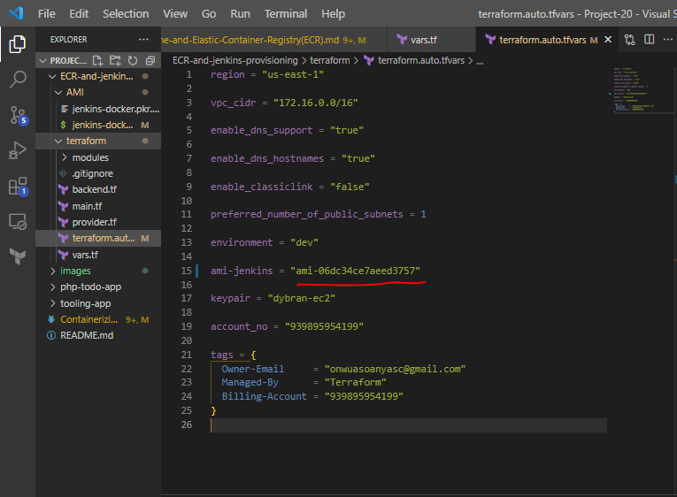
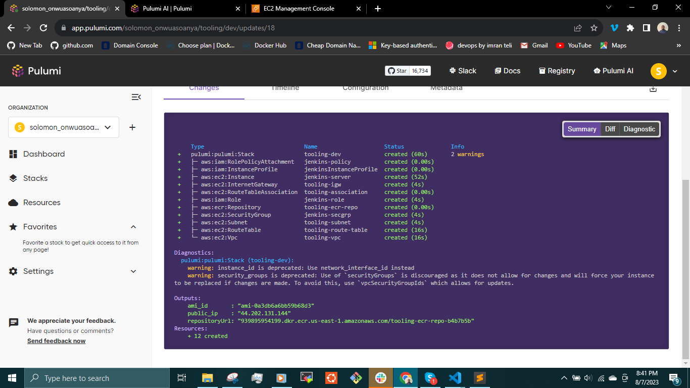

## __CONTAINERIZING A PHP APPLICATION USING JENKINS CI/CD PIPELINE AND ELASTIC CONTAINER REGISTRY (ECR).__

To deploy many small applications such as web front-end, web-backend, processing jobs, monitoring, logging solutions, etc, some of the applications will require various OS and runtimes of different versions and conflicting dependencies – in such case you would need to spin up serves for each group of applications with the exact OS/runtime/dependencies requirements. When it scales out to tens/hundreds and even thousands of applications, this approach becomes very tedious and challenging to maintain.

Also, when a developer develops an application and sends the application to another developer or DevOps Engineer in the software development team, there is always a problem where the code runs on the developer's computer but doesnt work on the computer of the team member. 

__SOLUTION:__

Containerization solves this problem. Unlike a VM, Docker allocates not the whole guest OS for your application, but only isolated minimal part of it – this isolated container has all that the application needs and at the same time is lighter, faster, and can be shipped as a Docker image to multiple physical or virtual environments, as long as this environment can run Docker engine. This approach also solves environment incompatibility issue.

In other words, if an application is shipped as a container it has its own environment that is isolated, and it will always work the same way on any server that has Docker engine.

This Project provides step-by-step instructions on how to containerize a PHP application using Jenkins (CI/CD) tool and Amazon Elastic Container Registry (ECR).

__Prerequisites__

- A Jenkins server installed and configured. You can install Jenkins by following the official documentation - [jenkins.io](https://www.jenkins.io/doc/book/installing/)
- Docker installed on the machine where Jenkins is running.
- AWS CLI installed in the jenkins server.

 The process involves creating a Docker image to ensure its optimal functionality and then utilizing Jenkins CI/CD in conjunction with __Terraform__ and __Packer__ to leverage infrastructure provisioning and AMI build. Alternatively, __Pulumi__ is employed for infrastructure provisioning enabling the smooth deployment of the Docker image to Amazon Elastic Container Registry (ECR).

__TASK__

__Using Terraform__

- Create the AMI for Jenkins server using Packer
- Utilize Terraform to deploy the necessary infrastructure components for Amazon Elastic Container Registry (ECR) and a Jenkins server. The Jenkins server instantiation will leverage a previously generated Amazon Machine Image (AMI) during the provisioning process.
- Configure Jenkins to build and push docker image to ECR.

__Using Pulumi__

- Utilize Pulumi to deploy the necessary infrastructure components for Amazon Elastic Container Registry (ECR) and a Jenkins server. Pulumi uses the script `jenkins-docker-setup.sh` to install jenkins and docker in the instance while provisioning.
- Configure Jenkins to build and push docker image to ECR.

Building Docker images prior to setting up the deployment pipeline for Amazon Elastic Container Registry (ECR) is considered a commendable approach from a technical standpoint. This practice ensures that the containerized applications or services are encapsulated within Docker images before they are transmitted to ECR for storage and distribution. By generating Docker images upfront, the pipeline can efficiently and reliably handle the deployment process, enabling seamless integration and automation of the containerization and delivery workflow to ECR.

Create an Ec2 Instance, install Docker and add the user to the docker group.

`$ sudo usermod -aG docker ubuntu`

Use the [docker documentation](https://docs.docker.com/engine/install/) to install docker.

Log out and log in to effect the changes.

Create a network:

Creating a custom network is not necessary because even if we do not create a network, Docker will use the default network for all the containers you run. 
There are use cases where this is necessary. If there is a requirement to control the __cidr__ range of the containers running the entire application stack. This will be an ideal situation to create a network and specify the __--subnet__

I will create a network with a subnet dedicated for this project and use it for both MySQL and the application so that they can connect.

`$ docker network create --subnet=10.0.0.0/24 tooling_app_network`

Verify this by running

`$ docker network ls`


Run the MySQL Server container using the created network.

First, let us create an environment variable to store the root password:

`$ export MYSQL_PW=<password>`

verify the environment variable is created

`$ echo $MYSQL_PW`

Then, pull the image and run the container in the network that was created earlier.

`$ docker run --network tooling_app_network -h mysqlserverhost --name=toolingdb -e MYSQL_ROOT_PASSWORD=$MYSQL_PW  -d mysql/mysql-server:latest`


To verify whether an image has been successfully pulled and if the container is running

`$ docker images`

`$ docker ps`


To adhere to best security practices, it is not recommended to establish remote connections to the MySQL server using the root user. Therefore, we adopt an alternative approach by creating an SQL script that generates a new user exclusively for remote connection purposes. This helps enhance the overall security of the system.

Create a file, name it __create_user.sql__ and add the below code in the file:

`CREATE USER 'dybran'@'%' IDENTIFIED BY '<password>';`

`GRANT ALL PRIVILEGES ON * . * TO 'dybran'@'%';` 


Ensure you are in the directory __create_user.sql__ file is located or declare the path.

Run the script

`$ docker exec -i toolingdb mysql -uroot -p$MYSQL_PW < create_user.sql`


Connect to the MySQL server from a second container running the MySQL client utility.

The advantage inherent in this approach is the elimination of the necessity to install any client-side tool on your laptop and the avoidance of direct connectivity to the container hosting the MySQL server.

Run the MySQL Client Container:

`$ docker run --network tooling_app_network --name toolingdb-client -it --rm mysql mysql -h mysqlserverhost -u dybran -p`


__Prepare database schema__

Prepare a database schema so that the __Tooling application__ can connect.

Clone the __Tooling-app repository__ [here](https://github.com/dybran/tooling-2).

`$ git clone https://github.com/dybran/tooling-2.git` 

On the terminal, export the location of the SQL file

`$ export DB_SCHEMA=/home/ubuntu/tooling-2/html/tooling_db_schema.sql`

Use the SQL script to create the database and prepare the schema. With the __docker exec__ command, you can execute a command in a running container.
`$ docker exec -i toolingdb mysql -u root -p$MYSQL_PW < $tooling_db_schema`


__Containerizing the Tooling Application__

Write the Dockerfile


Make sure you sure in the directory that has the Dockerfile.
i.e /home/ubuntu/tooling-2

Then run the command

`$ docker build -t tooling:1.0 .`


Update the __.env__ file with connection details to the database.

The __.env__ file is located in the html __tooling/html/.env__ folder but not visible in terminal.

`$ cd tooling-2/html/.env`

`$ sudo vi .env`


To get more information on the toolingdb container run the command

`$ docker inspect toolingdb`


We can use the above to find the __servername__ and so many other information about the container.

Open the __db__conn.php__ file and update the credentials to connect to the tooling database.


Environment variables are stored outside the codebase and are specific to the environment in which the application runs. The values are set on the server or in the hosting environment and are accessible by the PHP code using the _'$_ENV'__ superglobal array.

Run the container

`docker run --network tooling_app_network -p 9080:80 -it -d tooling:1.0`


Access the application through the browser

`<Ip-address>:9080`


Dsplay the running containers for the __tooling__ application and the __toolingdb__

`$ docker ps`

Stop the containers using the command

`$ docker stop <container-id>`


To remove the network

`$ docker network rm tooling_app_network`

## __AUTOMATE INFRASTRUCTURE PROVISIONING UTILIZING TERRAFORM OR PULUMI__

I will undertake the provisioning of the infrastructure through the utilization of __Terraform__. Additionally, I will demonstrate the provisioning process utilizing __Pulumi__, affording you the flexibility to select either of these Infrastructure as Code (IAC) tools.

## __Provisioning the Infrastructure using Terraform__

First, we build the AMI by utilizing the `jenkins-docker.sh` script, to prepare an AMI for the jenkins server.

```
#!/bin/bash

# The jenkins & docker shell script that will run on instance initialization


# Install jenkins and java
sudo apt-get update
sudo apt install openjdk-17-jre -y

curl -fsSL https://pkg.jenkins.io/debian-stable/jenkins.io-2023.key | sudo tee \
  /usr/share/keyrings/jenkins-keyring.asc > /dev/null
echo deb [signed-by=/usr/share/keyrings/jenkins-keyring.asc] \
  https://pkg.jenkins.io/debian-stable binary/ | sudo tee \
  /etc/apt/sources.list.d/jenkins.list > /dev/null
sudo apt-get update
sudo apt-get install jenkins -y


# Install docker
sudo apt-get install ca-certificates curl gnupg -y

sudo install -m 0755 -d /etc/apt/keyrings
curl -fsSL https://download.docker.com/linux/ubuntu/gpg | sudo gpg --dearmor -o /etc/apt/keyrings/docker.gpg
sudo chmod a+r /etc/apt/keyrings/docker.gpg
echo \
  "deb [arch="$(dpkg --print-architecture)" signed-by=/etc/apt/keyrings/docker.gpg] https://download.docker.com/linux/ubuntu \
  "$(. /etc/os-release && echo "$VERSION_CODENAME")" stable" | \
  sudo tee /etc/apt/sources.list.d/docker.list > /dev/null

sudo apt-get update
sudo apt-get install docker-ce docker-ce-cli containerd.io docker-buildx-plugin docker-compose-plugin -y


# Add ubuntu & Jenkins to the Docker group
sudo usermod -aG docker ubuntu
sudo usermod -aG docker jenkins

# run docker test container 
sudo docker run hello-world

# install aws cli
curl "https://awscli.amazonaws.com/awscli-exe-linux-x86_64.zip" -o "awscliv2.zip" 
sudo apt install unzip
sudo unzip awscliv2.zip  
sudo ./aws/install
aws --version

# start & enable jenkins
sudo systemctl start jenkins
sudo systemctl enable jenkins
```
The above script:
- installs java and jenkins
- Installs Docker
- Installs aws cli
- Adds jenkins and Ubuntu to the docker group

__N/B:__ Always refer to the documentation of the [jenkins](https://www.jenkins.io/doc/book/installing/linux/) and [Docker](https://docs.docker.com/engine/install/ubuntu/).

Run the command

`$ cd AMI`

`$ Packer build jenkins-docker.pkr.hcl`

 followed by the modification of the Terraform script to incorporate the AMI's endpoint information. AMI code is accessible [here](https://github.com/dybran/Project-20/tree/main/ECR-jenkins-terraform/AMI)

Compose the Terraform script for infrastructure provisioning, and subsequently integrate the AMI's endpoint details into the __terraform.auto.tfvars__. The Terraform code is accessible at [here](https://github.com/dybran/Project-20/tree/main/ECR-and-jenkins-provisioning/terraform).




Migrate the terraform codes to terraform cloud

To understand the process of migrating Terraform codes to the cloud, please make reference to [Project 19](https://github.com/dybran/Project-19/blob/main/Project-19.md).

`plan` and `apply`


The resources are created.


Establish an SSH connection to the Jenkins server and proceed with the configuration adjustments required to enable the build and push functionalities to the Elastic Container Registry (ECR)

`$ sudo systemctl start jenkins`

`$ sudo systemctl enable jenkins`

## __Provisioning the Infrastructure using Pulumi__

Provisioning infrastructure using Pulumi involves using code to define and manage cloud resources across various cloud providers like AWS, Azure, Google Cloud, and others. Pulumi allows you to define your infrastructure as code (IaC) using your preferred programming language, such as JavaScript, TypeScript, Python, Go, and more.


__Install Pulumi:__

Start by installing Pulumi on your development machine. You can find installation instructions for your specific operating system on the Pulumi website. Click [here](https://www.pulumi.com/docs/install/).

Open a terminal and create a new directory. Navigate to that directory and run the following command to create a new Pulumi project:

`$ pulumi new <template>`

Replace <template> with the appropriate template for your chosen programming language and cloud provider. For example, to create a new python project for AWS, you would run:

`$ pulumi new aws-python`

Follow the prompt to set up the pulumi project.


Open __main.py__ and write the pulumi code for provisioning the infrastructure and also provisioning the Jenkins server using the provided script. The script:
- installs java and jenkins
- Installs Docker
- Installs aws cli
- Adds jenkins and Ubuntu to the docker group

Then run the command

`$ pulumi up`

Select the option labeled __"Yes"__ to indicate your agreement with the allocation of resources for provisioning.


We can also use the link provided to see the provisioning in the pulumi console.




Now we can ssh into the jenkins-server and setup the configuration of an automated process for Docker image building. This setup involves Jenkins being triggered to initiate a build procedure upon detecting a push event within the GitHub repository, accomplished through the utilization of a webhook mechanism.

The initial step involves the installation of the __plugins__ essential for facilitating this process. This plugin installation is undertaken in conjunction with the execution of other mandatory configuration adjustments to enable the seamless operation of the intended process.

Log into the jenkins server and check if jenkins, docker and AWS CLI were installed and running successfully.

`$ sudo systemctl status jenkins`

`$ sudo systemctl status docker`

`$ aws --version`


Configure the jenkins server


On the github repository, configure the jenkins to use webhook.


Go to __manage jenkins > plugins__ and install the following plugins:

- __Docker Pipeline Plugin:__ This plugin allows you to define your Jenkins pipeline using Docker commands. It integrates Docker functionality directly into your Jenkins pipeline script.

- __Amazon ECR Plugin:__ This plugin provides integration with Amazon ECR. It allows you to easily push and pull Docker images to and from ECR repositories.

- __Blue Ocean:__ Blue Ocean aims to simplify the way you create, visualize, and manage your Jenkins pipelines. It offers a more user-friendly and visual approach to building and monitoring pipeline workflows.


Then got to __manage jenkins > system__ and configure the path to the __Jenkinsfile__ on the github repository.

Push the jenkinsfile to github

`$ git add .`

`$ git commit -m "updated jenkinsfile`

`$ git push`


