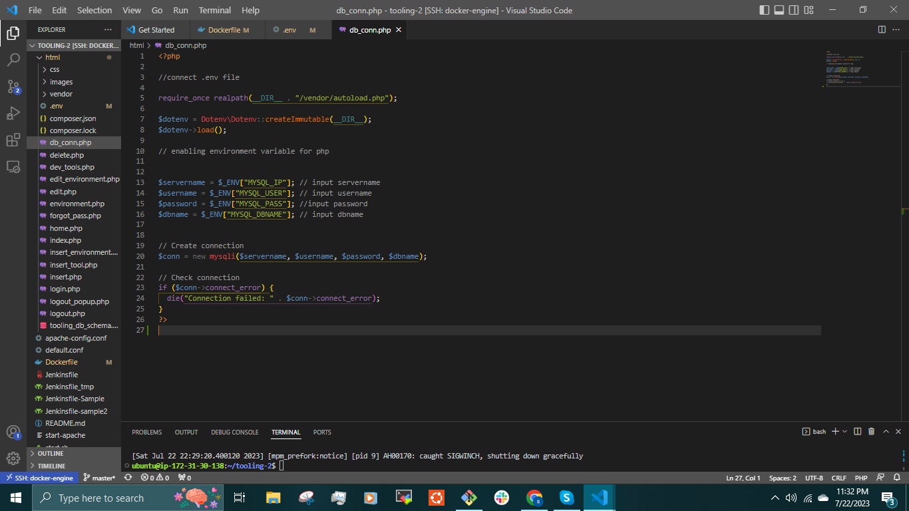

## CONTAINERIZING A PHP APPLICATION USING JENKINS CI/CD PIPELINE AND ELASTIC CONTAINER REGISTRY (ECR).

To deploy many small applications such as web front-end, web-backend, processing jobs, monitoring, logging solutions, etc, some of the applications will require various OS and runtimes of different versions and conflicting dependencies – in such case you would need to spin up serves for each group of applications with the exact OS/runtime/dependencies requirements. When it scales out to tens/hundreds and even thousands of applications, this approach becomes very tedious and challenging to maintain.

Also, when a developer develops an application and sends the application to another developer or DevOps Engineer in the software development team, there is always a problem where the code runs on the developer's computer but doesnt work on the computer of the team member. 

__SOLUTION:__

Containerization solves this problem. Unlike a VM, Docker allocates not the whole guest OS for your application, but only isolated minimal part of it – this isolated container has all that the application needs and at the same time is lighter, faster, and can be shipped as a Docker image to multiple physical or virtual environments, as long as this environment can run Docker engine. This approach also solves environment incompatibility issue.

In other words, if an application is shipped as a container it has its own environment that is isolated, and it will always work the same way on any server that has Docker engine.

This Project provides step-by-step instructions on how to containerize a PHP application using Jenkins (CI/CD) tool and Amazon Elastic Container Registry (ECR).

__Prerequisites__

- A Jenkins server installed and configured. You can install Jenkins by following the official documentation - [jenkins.io](https://www.jenkins.io/doc/book/installing/)
- Docker installed on the machine where Jenkins is running.
- AWS CLI installed in the jenkins server.

The process involves creating a Docker image to ensure its optimal functionality and then utilizing Jenkins CI/CD with Terraform and PAcker for infrastructure and AMI build respectively, enabling the smooth deployment of the Docker image to Amazon Elastic Container Registry (ECR).

__TASK__

- Create the AMI for Jenkins server using Packer
- Provision the Infrastructure for ECR and Jenkins server using Terraform. The Jenkins server will be provisioned using the AMI created.
- Configure Jenkins to build and push docker image to ECR.

Creating Docker images prior to setting up the deployment pipeline for Amazon Elastic Container Registry (ECR) is considered a commendable approach from a technical standpoint. This practice ensures that the containerized applications or services are encapsulated within Docker images before they are transmitted to ECR for storage and distribution. By generating Docker images upfront, the pipeline can efficiently and reliably handle the deployment process, enabling seamless integration and automation of the containerization and delivery workflow to ECR.

__Tooling Application__

create an Ec2 Instance, install Docker and add the user to the docker group.

`$ sudo usermod -aG docker ubuntu`

Use the [docker documentation](https://docs.docker.com/engine/install/) to install docker.

Log out and log in to effect the changes.

Create a network:

Creating a custom network is not necessary because even if we do not create a network, Docker will use the default network for all the containers you run. 
There are use cases where this is necessary. If there is a requirement to control the __cidr__ range of the containers running the entire application stack. This will be an ideal situation to create a network and specify the __--subnet__

I will create a network with a subnet dedicated for this project and use it for both MySQL and the application so that they can connect.

`$ docker network create --subnet=10.0.0.0/24 tooling_app_network`

Verify this by running

`$ docker network ls`

Run the MySQL Server container using the created network.

First, let us create an environment variable to store the root password:

`$ export MYSQL_PW=<password>`

verify the environment variable is created

`$ echo $MYSQL_PW`

Then, pull the image and run the container in the network that was created earlier.

`$ docker run --network tooling_app_network -h mysqlserverhost --name=toolingdb -e MYSQL_ROOT_PASSWORD=$MYSQL_PW  -d mysql/mysql-server:latest`

To verify whether an image has been successfully pulled and if the container is running

`$ docker images`

`$ docker ps`

Establishing remote connections to the MySQL server using the root user is discouraged to adhere to best security practices. Consequently, our approach involves crafting an SQL script to generate a new user specifically intended for remote connection purposes.

Create a file, name it __create_user.sql__ and add the below code in the file:

`CREATE USER 'dybran'@'%' IDENTIFIED BY '<password>';`

`GRANT ALL PRIVILEGES ON * . * TO 'dybran'@'%';` 

Ensure you are in the directory __create_user.sql__ file is located or declare the path.

Run the script

`$ docker exec -i toolingdb mysql -uroot -p$MYSQL_PW < create_user.sql`

Connect to the MySQL server from a second container running the MySQL client utility.

The advantage inherent in this approach is the elimination of the necessity to install any client-side tool on your laptop and the avoidance of direct connectivity to the container hosting the MySQL server.

Run the MySQL Client Container:

`$ docker run --network tooling_app_network --name toolingdb-client -it --rm mysql mysql -h mysqlserverhost -u dybran -p`

__Prepare database schema__

Prepare a database schema so that the __Tooling application__ can connect.

Clone the __Tooling-app repository__ [here](https://github.com/dybran/tooling-2).

`$ git clone https://github.com/dybran/tooling-2.git` 

On the terminal, export the location of the SQL file

`$ export DB_SCHEMA=/home/ubuntu/tooling-2/html/tooling_db_schema.sql`

Use the SQL script to create the database and prepare the schema. With the __docker exec__ command, you can execute a command in a running container.
`$ docker exec -i toolingdb mysql -u root -p$MYSQL_PW < $tooling_db_schema`

__Containerizing the Tooling Application__

Write the Dockerfile

Make sure you sure in the directory that has the Dockerfile.
i.e /home/ubuntu/tooling-2

Then run the command

`$ docker build -t tooling:1.0 .`

Update the __.env__ file with connection details to the database.

The __.env__ file is located in the html __tooling/html/.env__ folder but not visible in terminal.

`$ cd tooling-2/html/.env`

`$ sudo vi .env`

To get more information on the toolingdb container run the command

`$ docker inspect toolingdb`

We can use the above to find the __servername__ and so many other information about the container.

Open the __db__conn.php__ file and update the credentials to connect to the tooling database.

Environment variables are stored outside the codebase and are specific to the environment in which the application runs. The values are set on the server or in the hosting environment and are accessible by the PHP code using the _'$_ENV'__ superglobal array.

Run the container

`docker run --network tooling_app_network -p 9080:80 -it -d tooling:1.0`

Access the application through the browser

`<Ip-address>:9080`

Dsplay the running containers for the __tooling__ application and the __toolingdb__

`$ docker ps`

Stop the containers using the command

`$ docker stop <container-id>`

To remove the network

`$ docker network rm tooling_app_network`

__Containerizing a PHP-Todo Application__

Create a network for the application

`$ docker network create --subnet=10.0.2.0/24 php_todo_network`

Clone the repository- [php-todo app](https://github.com/dybran/php-todo) and `cd`

`$ git clone https://github.com/dybran/php-todo.git`

`cd php-todo`

